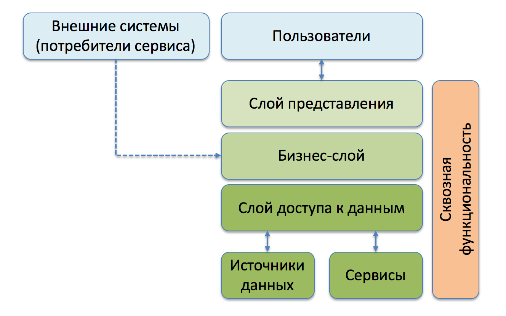
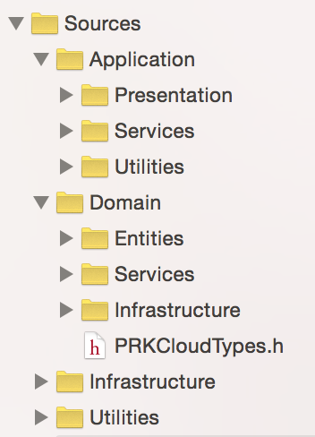
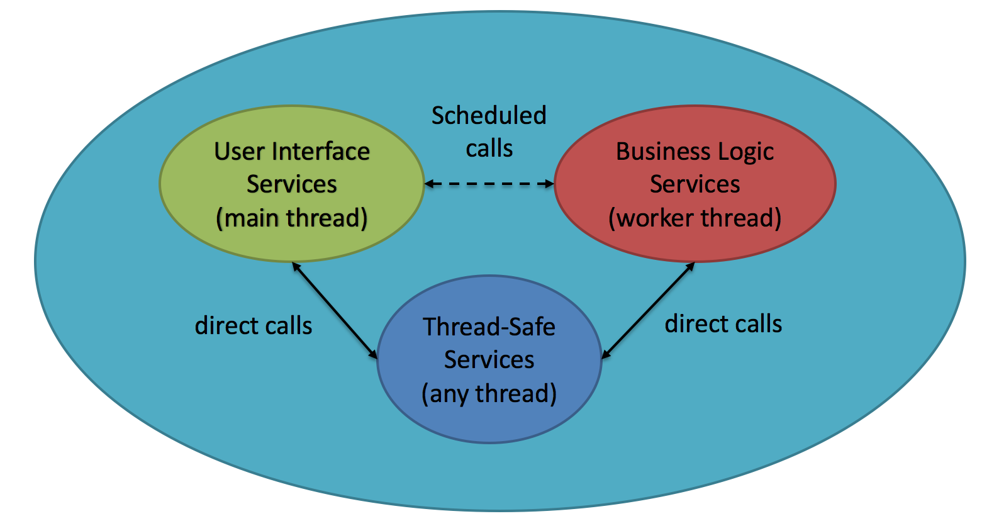

Разбор архитектуры бизнес-приложения для iOS
============================================
В репозитории представлена классическая архитектура бизнес-приложения для iOS. В качестве примера представлено
приложение, получающее фотографии из облачного хранилища Dropbox.


## Макропаттерны

Ниже рассматриваются основные макропаттерны, использованные при проектировании. 

### Layered Architecture

В классической литературе слоеная архитектура представляется следующей схемой.



Важнейший принцип многослойности состоит в том, что любой элемент какого-нибудь слоя зависит от
рабо­ты только других элементов того же слоя или элементов более низких слоев. Пе­редача информации
наверх должна выполняется только косвенными способом.

В проекте PhotoPark каждый слой предствлен отдельной папкой и расставлены они отнюдь не по алфавиту,
а в соответствии с их положением на схеме выше.



Благодаря этому появляется эмпирика для контроля выполнения указанного правила. Внутри
каждой папки мы можем использовать только классы, функции, перечисления и т.д., объявленные в файлах
внутри этой папки или одной из нижележащих папок. Пройдемся по ним снизу вверх.

* Utilities. Впомогательный функционал.
* Infrastructure. Содержит в себе классы, не специфичные для данного приложения. В идеале там лежат
классы, которые могут повторно использоваться в разных приложениях. Можно относится к этой папке как
к кузнице open source библиотек.
* Domain. Функционал, специфичный для предметной области данного приложения. Здесь происходит моделирование сущностей и
связанных с ними бизнес-правил. Сущности находятся в папке Entities, а манипулирующие ими сервисы в 
папке Services. Помещая сюда класс, вы должны подумать, а действительно ли данный функционал
является неотемлемой частью предметной области. Объединив Domain с Infrastructure и Utilities, можно
получить SDK для вашего сервиса.
* Application. Классы и сервисы, связанные с отображением данных и бизнес-логикой данного приложения.
В ней вы увидите папочку Presentation, представляющею собой группу классов, ответственных за отображение
данных.

Дополнительно про слои можно почитать в следующей литературе:

* [Э .Эванс. Предметно-ориентированное проектирование.](http://bit.ly/1OcFAx8)
* [М. Фаулер. Архитектура корпоративных программных приложений.](http://bit.ly/1M8Qyzo)

### Protocol-Oriented Architecture

Все сервисы реализуеют некий протокол. Это позволяет легко делать для них разные реализации. Например,
реализовать сервис для забора картинок не только из Dropbox, но и из Облака Mail.Ru. Второй интересный
кейс - сделать заглушечную реализацию сервиса, чтобы написать юнит-тесты для их клиентов. Загляните в
папочку Tests данного проекта, чтобы посмотреть, каким образом пишется юнит-тест для `PRKKeyedStore`,
используя заглушечную реализацию `PRKKeyedStoreBackend`.

### Reactive Architecture

Применительно к данному приложению реактивное программирование выражено в следующих особенностях
дизайна сервисов:

* Все изменяемые свойства сервисов представлены сигналами (RACSignal).
* Все методы, возвращающие какие-либо данные, делают это с помощью механизма сигналов.

Данные два принципа минимализируют состояние объектов, являющееся источником всех ошибок. Общение
же сервисов между собой посредством сигналов делает удобным их связывание используя механизмы
библиотеки ReactiveCocoa.

Дополнительная литература по теме:
* [Ash Furrow. Functional Reactive Programming on iOS](http://bit.ly/1kYzLsL)

### Schedulable Architecture

В программе все сервисы отнесены к одной из 3-х категорий:
* UI (User Interface). Сервисы, ответственные за визуальное взаимодейтсвие с пользователем. Все их
методы должны отрабатывать в главном потоке приложения. Взаимодействие с UIKit может происходить только
из главного потока приложения.
* BL (Business Logic). Сервисы, ответственные за операции, не связанные с визуальной составляющей
приложения. Они принципиально не делаются потокобезопасными (об этом ниже). Обработка методов происходит
отдельным планировщиком задач (scheduler) в отдельном рабочем потоке.
* TS (Thread-Safe). Сервисы, использование которых допустимо из любого потока. Как правило это
сервисы с "легкими" операциями, не способными привести к деградации отзывчивости приложения. Поскольку
они могут использоватся как из UI-ного потока, так и из BL-ного потока, то методы сервисов обязаны быть
потокобезопасными. В случае, если некоторые сервисы начинают негативно влиять на UX приложения, они
могут быть перемещены в разряд BL-сервисов, несмотря на свою потокобезопасную природу.

Визуально это выглядит следующим образом:



Причина данного разбиения в желании избежать "подтормаживания" пользовательского интерфейса при 
интенсивном выполнении операций бизнес-логики. Благодаря тому, что бизнес-логика выделена в отдельный
поток с низким приоритетом, не видная глазу пользователя активность приложения не будет находить
свое отражение на плавности, с которой он перемещается между экранами.

Каждый планируемый сервис живет в синхронной среде относительно сервисов своего же планировщика. Другими
словами, планирование сервисов приводит к тому, что ни один метод данного сервиса не выполняется параллельно
с любым методом сервиса из того же планировщика. Рассмотрим этот аспект на примере. В приложении есть несколько
сервисов, живущих в BL-ном планировщике. Они реализуют следующие интерфейсы:

```objective-c
@protocol PRKNodeFetcher <POSSchedulable>
- (nonnull RACSignal *)fetchNodes;
@end


@protocol PRKThumbnailFetcher <POSSchedulable>
- (nonnull RACSignal *)fetchThumbnailForNode:(nonnull PRKMediaNode *)node;
@end


@protocol PRKHost <POSSchedulable>
@property (nonatomic, readonly) NSURL *URL;
- (RACSignal *)pushRequest:(POSHTTPRequest *)request;
- (RACSignal *)pushRequest:(POSHTTPRequest *)request
                   options:(POSHTTPRequestExecutionOptions *)options;
@end
```

Имплементации сервисов `PRKNodeFetcher` и `PRKThumbnailFetcher` для выполнения своей работы используют 
метод `pushRequest:` у `PRKHost`. Посольку BL-ный планировщик гарантирует, что методы `fetchNodes` и
`fetchThumbnailForNode:` не могут выполняться параллельно, эти методы могут напрямую использовать метод
`pushRequest:` у `PRKHost`, а имплементация `PRKHost` в свою очередь избавляется от необходимости реализовывать
`pushRequest:` потокобезопасно.

Объекты, живующие в разных планировщиках, не могут вызывать методы друг друга напрямую. Их методы
выполняются параллельно и если бы они дергали методы друг друга напрямую, то их пришлось бы делать
потокобезопасными, а это, во-первых, непосильный труд, а во-вторых, из-за многочисленных синхронизаций наше
приложение стало бы тормозить еще больше, чем было бы в классической однопоточной архитектуре. Предствьте, что
`PRKThumbnailFetcher` из неких соображений, продиктованных бизнес-логикой, вызвал бы в своей имлементации метод
`fetchNodes` у `PRKNodeFetcher`. Одновременно с этим некий ViewController, неявно живущий в UI-ном планировщике,
тоже решил получить свежие ноды у `PRKNodeFetcher`. Допустим потокобезопасная реализация метода `fetchNodes`
блокирует мьютексом свое тело. Получается, что наш UI-ный поток заблокировался до тех пор, пока `fetchNodes`
не отработает сначала для `PRKThumbnailFetcher`, а уже потом для ViewController. Получаем тормоза GUI из-за
выполнения бизнес-логики, а именно этого мы и хотели избежать, используя в архитектруре приложения паттерн
Schedulable Architecture. Именно поэтому, как упоминалось выше, имплементации планируемых сервисов принципиально
не делаются потокобезопасными, чтобы не было соблазнов использовать их напрямую из UI-потока.

Вызов методов сервиса, живущего в другом планировщке, происходит опосредованно. Делается этого с использованием
родного для этого сервиса планировщика. Родной планировщик всегда доступен через свойство `scheduler` требуемого
сервиса или же можно произвести вызов через блок, переданный в метод `schedule:`. Вот так обновляет свои данные
`FeedViewController`, живущий в UI-ном потоке: 

```objective-c
- (void)p_updateDataSource {
    id<PRKNodeFetcher> nodeFecher = self.assembly.BL.nodeFetcher;
    [nodeFecher schedule:^{
        [[[nodeFecher fetchNodes] deliverOn:[RACScheduler mainThreadScheduler]]
         subscribeNext:^(NSArray *nodes) {
             NSLog(@"Number of fetched nodes: %@", @(nodes.count));
             self.nodes = nodes;
         } error:^(NSError *error) {
             NSLog(@"Failed to fetch nodes: %@", error);
         } completed:^{
             NSLog(@"done");
         }];
    }];
}
```

Обратите внимание на следующий момент. Польсоку `FeedViewConroller` живет в UI-потоке и его методы не является
потокобезопасными (в данном случае setter для нод), он должен обновлять свои данные исключительно в UI-потоке.
Для этого он перенапрявляет результат выполнения функции в UI-планировщик с помощью метода `deliverOn:` у `RACSignal`.

Архитектурно макропаттерн Schedulable Architecture поддержан следующими образом:
* В качестве базового класса использован POSSchedulableObject из библиотеки [POSRx](https://github.com/pavelosipov/POSRx).
Данный класс в отладочной сборке навешивает хуки на все методы класса за исключением getter-ов atomic-свойств.
В этих хуках происходит проверка допустимости вызова метода в контексте текущего потока. Если вызов недопустим, то
POSSchedulableObject даст вам знать :)
* Все сущности, находящиеся в папке Entities приложения, реализуются как неизменяемые Algebraic Data Types. Все их свойства
помечены как readonly и их изменение после создания объекта класса не происходит. Это позволяет передавать их в качестве
аргументов методам планируемых сервисов и не переживать за многопоточный доступ к их свойствам без какой бы то ни было
потокобезопасной реализации.

При зашедуливании всех объектов в UI-планировщике данная архитектура вырождается в классическую с одним UI-ным потоком.

Дополнительная литература по теме:
* [Debasish Ghosh. Functional and Reactive Domain Modeling](http://bit.ly/1Rik1uN)

### Domain = Immutable Entities + Services

Все манипуляции над неизменяемыми сервисами происходят в специальных сервисах. Это позволяет достичь сразу двух
важных целей:

1. Отсутствие методов-мутаторов у сущностей позволяет сделать их состояние неизменным после создания. Константные
объекты могут потокобезопасны по своей природе, что делает возможным их совместное использование в в сервисах,
живущих в разных планировщиках.
2. Отсутствие реализации прикладной логики силами объектов модели избавляет их от шлейфа зависимостей от каких-либо внешних
библиотек.

Про первый пункт было сказано выше. Рассмотрим п.2 на примере приложения по проигрыванию музыки. Перед приложением стоит
4 задачи:

1. Проигрывание музыки.
2. Ковертация музыки.
3. Поиск музыки по исполинтелю.
4. Рекомендация музыки на основе истории прослушивания.

Вариант 1. Реализовать проигрывание трека силами класса MusicTrack:

```objective-c
@interface PRKMusicTrack : NSObject

@property (nonatomic, readonly) PRKMusicFormatType format;
@property (nonatomic, readonly) NSInteger position;

- (void)play;
- (nonnull PRKMusicTrack *)convertToFormat:(PRKMusicFormatType)format;

@end
```

Допустим, для проигрывания музыки мы используем фреймворк AVFoundation, а для конвертации библиотеку ffmpeg.
Таким образом наш PRKMusicTrack стал жестко привязан к этим внешним библиотекам. По цепочке все другие классы,
использующие класс PRKMusicTrack, стали опосредованно зависимыми от них, а это:

1. MusicTrackPlayerViewController.
2. MusicTrackConverterViewController.
3. MusicSearchViewController.
4. MusicSuggesterViewController.

Все 4 класса автоматически теперь зависимы от AVFoundation и ffmpeg, хотя в реальности функциональностью первого фреймворка
косвенно пользуется только MusicTrackPlayerViewController, функционалом второго - MusicTrackConverterViewController, а
а остальные классы получили это наследство просто так.

Дальше - больше. Допустим сервис рекомендаций оказался настолько успешным, что мы решили сделать отедбное приложение для
рекомендации музыки. Чтобы повторно использовать код, мы сделали фреймворк-SDK, который совметно использующийся нашим
приложением-плеером и приложение для рекомендаций музыки. Разумеется в SDK попал класс PRKMusicTrack. Однако посольку он
завязан на AVFoundation и ffmpeg, наше SDK также автоматически становится зависимым от этих внешних библиотек.
Получаем плохую ситуацию, что наше приложение по рекомендации музыки тащит за собой библиотеки, которые вообще им
не используются.

В решении данной архитектурной проблемы нам помогают сервисы. Они реализовывают бизнес-функционал и уже они начинают
зависеть от внешних библиотек. В результате рефакторинга имеем следующие интерфейсы наших классов:

```objective-c
@interface PRKMusicTrack : NSObject
@property (nonatomic, readonly) PRKMusicFormatType format;
@property (nonatomic, readonly) NSInteger position;
@end

@protocol PRKMusicTrackPlayer <NSObject>
- (void)playTrack:(nonnull PRKMusicTrack *)track;
@end

@protocol PRKMusicTrackConverter <NSObject>
- (nonnull PRKMusicTrack *)convertTrack:(nonnull PRKMusicTrack *)track
                               toFormat:(PRKMusicFormatType)format;
@end
```

Теперь каждый из наших 4-х ViewController-ов пользуется только нужным ему сервисом и таким образом не зависит от 
ненужных ему библиотек.

В наше SDK не будет включен сервис PRKMusicTrackPlayer, посольку приложению для рекомендаций он ненужен, и таким
образом второе приложение избавлено от лишних библиотек.

### Open/Closed Principle

Все инфраструктурные сервисы удовлетворяют [Open/Closed принципу](https://en.wikipedia.org/wiki/Open/closed_principle).
Рассмотрим его суть на примере инфраструктурного сетевого сервиса. Не соответствующая данному принципу реализация будет
иметь большое, но ограниченное число методов для выполнения запросов. Хорошая - предоставит возможность добавлять
свои типы запросы без модификации своего исходого кода. Давайте сравним
[AFHTTPRequestOperationManager](https://github.com/AFNetworking/AFNetworking/blob/master/AFNetworking/AFHTTPRequestOperationManager.h)
из библиотеки [AFNetworking](https://github.com/AFNetworking/AFNetworking) и
[POSHTTPGateway](https://github.com/pavelosipov/POSRx/blob/master/POSRx/Networking/Gateway/POSHTTPGateway.h)
из уже известного вам [POSRx](https://github.com/pavelosipov/POSRx). В первой есть большое количество методов для выполнения
HTTP-запросов. Например, вот такой выглядит GET-запрос:

```objective-c
AFHTTPRequestOperationManager *manager = [AFHTTPRequestOperationManager manager];
[manager GET:@"http://example.com/resources.json" parameters:nil success:^(AFHTTPRequestOperation *operation, id responseObject) {
    NSLog(@"JSON: %@", responseObject);
} failure:^(AFHTTPRequestOperation *operation, NSError *error) {
    NSLog(@"Error: %@", error);
}];
```

Есть аналогичная плеяда методов для других типов запросов. Итого имеем жесткий интерфейс без возможности добавления новых типов
запросов. В `POSHTTPGateway` есть только ОДИН метод, мощность которого превосходит все вышеперечисленные у `AFHTTPRequestOperationManager`. 

```objective-c
- (RACSignal *)pushRequest:(id<POSHTTPRequest>)request
                    toHost:(NSURL *)hostURL
                   options:(POSHTTPRequestExecutionOptions *)options;
```

Принимая на вход абстрактный "запрос", он оставляет на откуп прикладному коду создавать запросы конкретного типа.
Например, данное приложение имеет в папочке Networking микробертки для декларативного создания GET и POST запросов.
Пример их использования можно посмотреть в реализации `PRKNodeFetcher`:

```objective-c
- (RACSignal *)fetchNodes {
    return [_host pushRequest:
            [PRKHTTPPOST
             path:@"/delta"
             parameters:@{@"path_prefix": @"/Camera Uploads",
                          @"include_media_info": @"true"}
             dataHandler:^id(NSData *responseData, NSError **error) {
                 PRKDropboxDeltaFetchResult *fetchResult = [PRKDropboxDeltaFetchResult
                                                            parseDeltaResponseData:responseData];
                 return fetchResult.nodes;
             }]];
}
```

Представленный POST-запрос выглядит чуть более "шумно", чем POST-запрос у `AFHTTPRequestOperationManager`,
но при этом открываются дополнительные возможности. Так, если потребуется делать запрос на дельту в других сервисах
приложения, во избежании дублирования кода можно создать предметно-ориентированный тип запроса и использовать
его наравне со стандартными GET, POST и др.:

```objective-c
- (RACSignal *)fetchNodes {
    return [_host pushRequest:[PRKDropboxDeltaRequest new]];
}
```

Подобная возможность добавления функциональности без модфикации самой библиотеки - это и есть Open/Closed Principle.

В коде проекта `PRKKeyedStore` и `PRKTracker` также полностью соответствуют принципу Open/Closed.

## На затравку

Сейчас в реализации данного приложения есть по крайней мере один изъян. Заключается он в том, что для отображения
всех картинок из Dropbox необходимо полностью сохранить их в `PRKFeedViewController`. У меня в Dropbox фоток огромное
количество и держать их все в оперативной памяти весьма накладно. Приходите на мою лекцию по кешированию данных
(Persistence) - будем решать бороться с этим изъяном.
